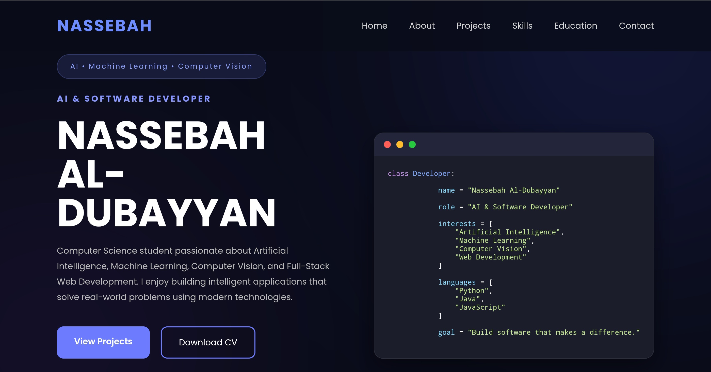

# 🌐 Nassebah Al-Dubayyan Portfolio

A modern personal portfolio website showcasing my background, technical skills, and software projects in Artificial Intelligence, Computer Vision, Machine Learning, and Full-Stack Web Development.

---

## 🌍 Live Website

**Portfolio:**  
https://nassebah.infinityfreeapp.com/

---

## ✨ Features

- Responsive modern design
- About Me section
- Technical skills showcase
- Featured projects
- Education
- Contact form
- Downloadable CV
- SEO optimized
- Structured Data (Schema.org)
- Open Graph metadata

---

## 🛠️ Technologies Used

- HTML5
- CSS3
- JavaScript
- EmailJS
- Google Fonts

---

## 📸 Preview

Replace the image below with a screenshot of your portfolio.

---

## 🚀 Featured Projects

- AI Physiotherapy Rehabilitation System
- Animal Image Classifier
- Stroke Prediction System

---

## 📄 Resume

The latest version of my CV can be downloaded directly from the portfolio website.

---

## ⭐ If you like this project

If you found this portfolio inspiring, consider giving the repository a ⭐.
